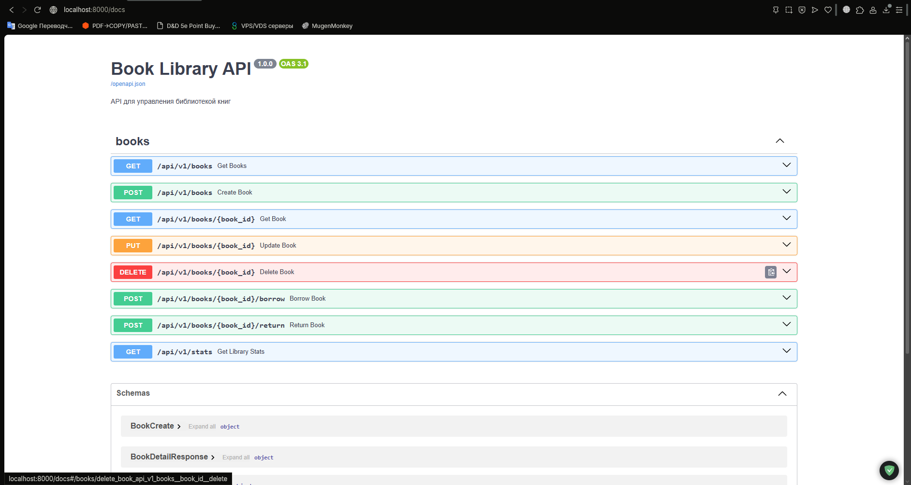
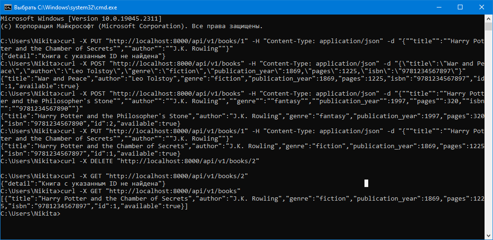
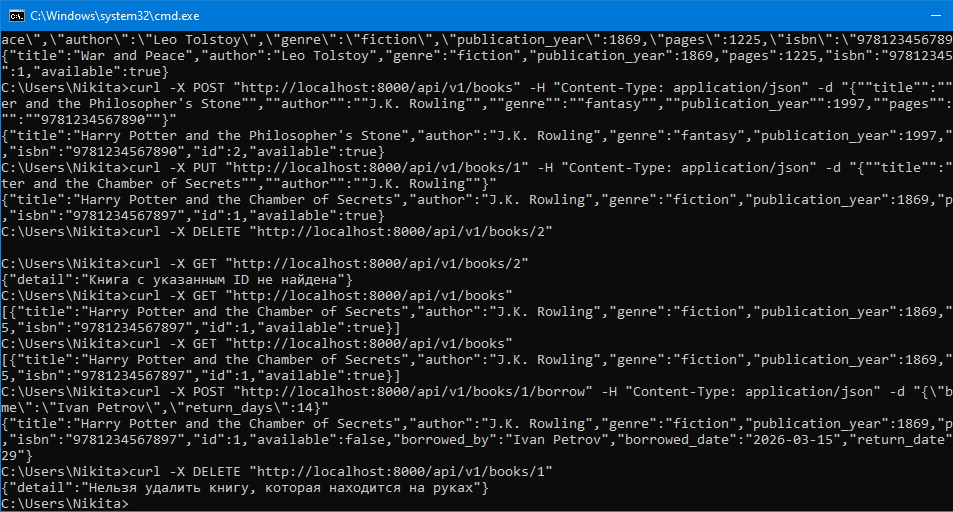

# Отчет по лабораторной работе №2
# Разработка REST API на FastAPI (Python)

**Дата:** 2026-03-15  
**Семестр:** 2 курс, 2 полугодие (4 семестр)  
**Группа:** ПИН-231  
**Дисциплина:** Технологии программирования  
**Студент:** Герда Никита Андреевич

---

## Цель работы
Практическое знакомство с созданием RESTful API на современном Python-фреймворке FastAPI. Освоение принципов валидации данных с помощью Pydantic, автоматической генерации документации OpenAPI и асинхронной обработки запросов.

---

## Теоретическая часть
В ходе выполнения работы были изучены следующие концепции:
- **FastAPI** – современный веб-фреймворк для создания API с высокой производительностью, основанный на Starlette и Pydantic.
- **Pydantic** – библиотека для валидации данных на основе аннотаций типов Python. Позволяет определять модели с автоматической проверкой, преобразованием и сериализацией.
- **Автоматическая документация** – FastAPI генерирует OpenAPI (Swagger) спецификацию, которая доступна в интерактивном интерфейсе Swagger UI (/docs) и ReDoc (/redoc).
- **HTTP статус-коды** – использование стандартных кодов для информирования клиента о результате запроса (200, 201, 204, 400, 404 и т.д.).
- **CORS** – механизм, позволяющий ограничить доступ к API с других доменов; в разработке часто разрешают все источники для удобства тестирования.

---

## Практическая часть

### Выполненные задачи
- [x] Задача 1: Реализация моделей данных (BookCreate, BookUpdate, BookResponse, BorrowRequest и др.) с валидацией через Pydantic.
- [x] Задача 2: Создание основного приложения FastAPI с подключением роутера и настройкой CORS.
- [x] Задача 3: Разработка CRUD-операций для книг (GET /books, GET /books/{id}, POST /books, PUT /books/{id}, DELETE /books/{id}).
- [x] Задача 4: Реализация эндпоинтов заимствования (POST /books/{id}/borrow) и возврата (POST /books/{id}/return).
- [x] Задача 5: Добавление фильтрации (по жанру, автору, доступности) и пагинации в GET /books.
- [x] Задача 6: Реализация эндпоинта статистики /stats (подсчёт количества книг, доступных/взятых, распределение по жанрам, самый популярный автор).
- [x] Задача 7: Исправление циклического импорта путём вынесения общей "базы данных" в отдельный модуль database.py.
- [x] Задача 8: Тестирование API через curl и Swagger UI, проверка обработки ошибок.

### Ключевые фрагменты кода

#### Модели данных (models.py) – фрагмент
```python
from pydantic import BaseModel, Field
from enum import Enum
from datetime import date

class Genre(str, Enum):
    FICTION = "fiction"
    NON_FICTION = "non_fiction"
    SCIENCE = "science"
    FANTASY = "fantasy"
    MYSTERY = "mystery"
    BIOGRAPHY = "biography"

class BookCreate(BaseModel):
    title: str = Field(..., min_length=1, max_length=200)
    author: str = Field(..., min_length=1, max_length=100)
    genre: Genre
    publication_year: int = Field(..., ge=1000, le=date.today().year)
    pages: int = Field(..., gt=0)
    isbn: str = Field(..., pattern=r'^\d{13}$')
```

#### Реализация эндпоинта получения списка книг с фильтрацией (routers.py)
```python
@router.get("/books", response_model=List[BookResponse])
async def get_books(
    genre: Optional[Genre] = Query(None, description="Фильтр по жанру"),
    author: Optional[str] = Query(None, description="Фильтр по автору"),
    available_only: bool = Query(False, description="Только доступные книги"),
    skip: int = Query(0, ge=0, description="Количество книг для пропуска"),
    limit: int = Query(100, ge=1, le=1000, description="Лимит книг на странице")
):
    filtered_books = []
    for book_id, book_data in books_db.items():
        if genre is not None and book_data["genre"] != genre:
            continue
        if author is not None and author.lower() not in book_data["author"].lower():
            continue
        if available_only and not book_data.get("available", True):
            continue
        filtered_books.append(book_to_response(book_id, book_data))
    return filtered_books[skip:skip+limit]
```

#### Эндпоинт заимствования книги
```python
@router.post("/books/{book_id}/borrow", response_model=BookDetailResponse)
async def borrow_book(book_id: int, borrow_request: BorrowRequest):
    if book_id not in books_db:
        raise HTTPException(status_code=404, detail="Книга не найдена")
    if not books_db[book_id].get("available", True):
        raise HTTPException(status_code=400, detail="Книга уже выдана")
    books_db[book_id]["available"] = False
    today = date.today()
    borrow_records[book_id] = {
        "borrower_name": borrow_request.borrower_name,
        "borrowed_date": today,
        "return_date": today + timedelta(days=borrow_request.return_days)
    }
    return await get_book(book_id)
```

#### Модуль database.py для разрыва циклического импорта
```python
# database.py
from typing import Dict
from models import BookResponse

books_db: Dict[int, dict] = {}
borrow_records: Dict[int, dict] = {}
current_id = 1

def get_next_id() -> int:
    global current_id
    id_ = current_id
    current_id += 1
    return id_

def book_to_response(book_id: int, book_data: dict) -> BookResponse:
    return BookResponse(
        id=book_id,
        title=book_data["title"],
        author=book_data["author"],
        genre=book_data["genre"],
        publication_year=book_data["publication_year"],
        pages=book_data["pages"],
        isbn=book_data["isbn"],
        available=book_data.get("available", True)
    )
```

---

## Результаты выполнения

### Пример работы программы (curl-запросы)

**1. Создание книги (POST)**
```bash
curl -X POST "http://localhost:8000/api/v1/books" \
  -H "Content-Type: application/json" \
  -d '{
    "title": "Harry Potter and the Philosopher'\''s Stone",
    "author": "J.K. Rowling",
    "genre": "fantasy",
    "publication_year": 1997,
    "pages": 320,
    "isbn": "9781234567890"
  }'
```
Ответ (201 Created):
```json
{
  "id": 1,
  "title": "Harry Potter and the Philosopher's Stone",
  "author": "J.K. Rowling",
  "genre": "fantasy",
  "publication_year": 1997,
  "pages": 320,
  "isbn": "9781234567890",
  "available": true
}
```

**2. Получение списка книг (GET)**
```bash
curl "http://localhost:8000/api/v1/books?genre=fantasy&available_only=true"
```

**3. Заимствование книги (POST /borrow)**
```bash
curl -X POST "http://localhost:8000/api/v1/books/1/borrow" \
  -H "Content-Type: application/json" \
  -d '{"borrower_name": "Ivan Petrov", "return_days": 14}'
```
Ответ (200 OK) с деталями заимствования:
```json
{
  "id": 1,
  "title": "Harry Potter and the Philosopher's Stone",
  "author": "J.K. Rowling",
  "genre": "fantasy",
  "publication_year": 1997,
  "pages": 320,
  "isbn": "9781234567890",
  "available": false,
  "borrowed_by": "Ivan Petrov",
  "borrowed_date": "2026-03-15",
  "return_date": "2026-03-29"
}
```

**4. Возврат книги (POST /return)**
```bash
curl -X POST "http://localhost:8000/api/v1/books/1/return"
```
Книга снова доступна.

**5. Статистика библиотеки**
```bash
curl "http://localhost:8000/api/v1/stats"
```
Пример ответа:
```json
{
  "total_books": 5,
  "available_books": 4,
  "borrowed_books": 1,
  "books_by_genre": {
    "fantasy": 2,
    "fiction": 3
  },
  "most_prolific_author": "J.K. Rowling"
}
```

### Скриншоты
*Скриншоты недоступны в текстовом отчёте, но были сделаны:*
- .
- .
- .

### Тестирование
- **Ручное тестирование:** все эндпоинты проверены через curl и Swagger UI, включая граничные случаи (неверный ISBN, попытка взять уже взятую книгу, удаление несуществующей книги).
- **Проверка уникальности ISBN:** при попытке создать книгу с существующим ISBN возвращается 400 Bad Request.
- **Проверка бизнес-логики:** удаление книги возможно только если она доступна (available=True).
- **Пагинация и фильтрация:** работают корректно.

---

## Выводы
1. **FastAPI значительно упрощает разработку API** благодаря автоматической валидации данных через Pydantic и встроенной поддержке асинхронности. Это позволяет быстро создавать надёжные и документированные интерфейсы.
2. **Использование Pydantic моделей** обеспечивает чёткую структуру данных, проверку типов и генерацию понятных сообщений об ошибках, что критически важно для API.
3. **Автоматическая документация OpenAPI** (Swagger UI) экономит время на написание документации и позволяет клиентам сразу тестировать эндпоинты.
4. **Правильная обработка HTTP статус-кодов** и краевых случаев (например, невозможность удалить взятую книгу) повышает надёжность и удобство использования API.
5. **Разделение кода на модули** (models, routers, database) помогает избежать циклических импортов и улучшает поддерживаемость проекта.

---

## Ответы на контрольные вопросы

1. **В чем преимущества использования Pydantic моделей для валидации?**  
   Pydantic автоматически проверяет типы данных, преобразует значения (например, строку в число) и генерирует понятные сообщения об ошибках. Модели легко интегрируются с FastAPI, предоставляя валидацию запросов и сериализацию ответов. Кроме того, они автоматически создают JSON-схемы, которые используются в документации OpenAPI.

2. **Как работает автоматическая документация в FastAPI?**  
   FastAPI анализирует сигнатуры функций-обработчиков, используемые Pydantic-модели, параметры запросов (Query, Path, Body) и возвращаемые типы. На основе этой информации строится OpenAPI спецификация (в формате JSON), которая затем отображается в Swagger UI и ReDoc. Документация всегда актуальна и позволяет выполнять запросы прямо из браузера.

3. **Почему важно проверять уникальность ISBN?**  
   ISBN (International Standard Book Number) является уникальным идентификатором книги. Дублирование ISBN приведёт к путанице в каталоге, невозможности однозначно идентифицировать экземпляр, проблемам при поиске и заимствовании. Проверка уникальности гарантирует целостность данных и корректную работу библиотечной системы.

4. **Какие статус-коды HTTP вы использовали и почему?**  
   - **200 OK** – успешное выполнение GET, PUT, POST (для запросов, возвращающих данные).  
   - **201 Created** – успешное создание ресурса (POST /books).  
   - **204 No Content** – успешное удаление (DELETE), когда не нужно возвращать тело ответа.  
   - **400 Bad Request** – ошибка валидации входных данных или нарушение бизнес-логики (например, книга уже взята).  
   - **404 Not Found** – запрашиваемый ресурс не существует (книга с указанным ID).  
   Использование стандартных кодов делает API интуитивно понятным для клиентов.

---

## Приложения
- Исходный код проекта доступен в репозитории: [ссылка на GitHub](https://github.com/Nocotov77/lab02gerda)
- Скриншоты работы API приложены к отчёту отдельными файлами.