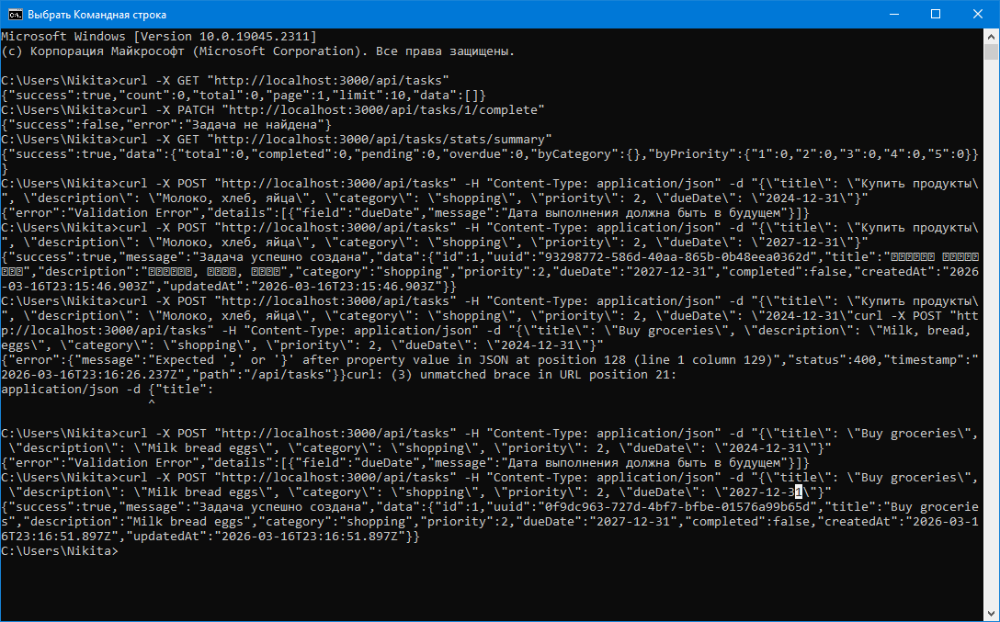
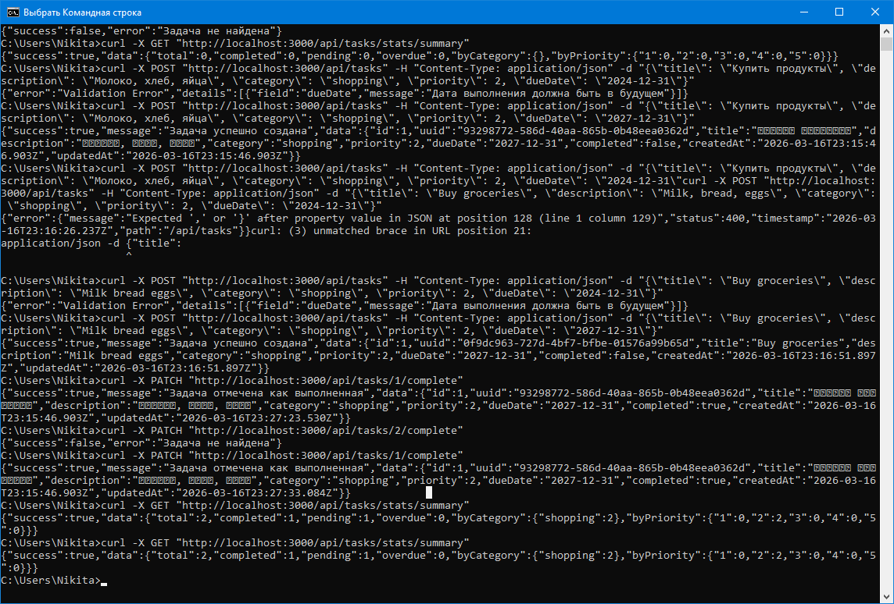

# Отчет по лабораторной работе №2. Часть 2  
# Разработка REST API с использованием Express и Node.js

**Дата:** 2026-03-17  
**Семестр:** 2 курс, 2 полугодие (4 семестр)  
**Группа:** ПИН-б-о-24-1  
**Дисциплина:** Технологии программирования  
**Студент:** Герда Никита Андреевич 

---

## Цель работы
Практическое знакомство с созданием RESTful API на Node.js с использованием Express. Освоение middleware, валидации данных, работы с файловой системой и сравнение подходов разных фреймворков.

---

## Теоретическая часть
В ходе работы были изучены следующие концепции:
- **Express.js** — минималистичный веб-фреймворк для Node.js, позволяющий быстро создавать REST API.
- **Middleware** — функции, имеющие доступ к объектам запроса и ответа, выполняющиеся до или после обработки маршрута. Использовались: helmet (безопасность), cors (кросс-доменные запросы), rate-limit (ограничение числа запросов), собственные валидаторы и обработчики ошибок.
- **Валидация данных** с помощью библиотеки **Joi** — описание схем и генерация понятных сообщений об ошибках.
- **Хранение данных** в файле `tasks.json` с использованием модуля `fs.promises` для асинхронных операций.
- **Структурирование проекта** — разделение на маршруты, middleware, утилиты.

---

## Практическая часть

### Выполненные задачи
- [x] Задача 1: Реализация CRUD операций для управления задачами (GET, POST, GET/:id, PUT, PATCH/complete, DELETE).
- [x] Задача 2: Фильтрация, сортировка и пагинация при получении списка задач.
- [x] Задача 3: Эндпоинт статистики `/stats/summary` (общее количество, выполненные, просроченные, распределение по категориям и приоритетам).
- [x] Задача 4: Поиск задач по тексту (`/search/text?q=...`).
- [x] Задача 5: Добавление корневого маршрута `/` и маршрута для проверки здоровья `/health`.
- [x] Задача 6: Обработка ошибок (404, 400, 500) с единым форматом ответа.

### Ключевые фрагменты кода

**Фильтрация, сортировка и пагинация (фрагмент `routes/tasks.js`):**
```javascript
// GET /api/tasks
router.get('/', async (req, res, next) => {
  try {
    const { category, completed, priority, sortBy, page = 1, limit = 10 } = req.query;
    const data = await readData();
    let tasks = [...data.tasks];

    // Фильтрация
    if (category) tasks = tasks.filter(t => t.category === category);
    if (completed !== undefined) {
      const isCompleted = completed === 'true';
      tasks = tasks.filter(t => t.completed === isCompleted);
    }
    if (priority) {
      const priorities = priority.split(',').map(Number);
      tasks = tasks.filter(t => priorities.includes(t.priority));
    }

    // Сортировка
    if (sortBy) {
      const [field, order] = sortBy.startsWith('-') ? [sortBy.substring(1), 'desc'] : [sortBy, 'asc'];
      tasks.sort((a, b) => {
        if (field === 'dueDate' || field === 'createdAt') {
          const dateA = new Date(a[field] || 0);
          const dateB = new Date(b[field] || 0);
          return order === 'asc' ? dateA - dateB : dateB - dateA;
        } else if (field === 'priority') {
          return order === 'asc' ? a.priority - b.priority : b.priority - a.priority;
        }
        return 0;
      });
    }

    // Пагинация
    const startIndex = (page - 1) * limit;
    const paginatedTasks = tasks.slice(startIndex, startIndex + parseInt(limit));

    res.json({ success: true, count: paginatedTasks.length, total: tasks.length, page, limit, data: paginatedTasks });
  } catch (error) {
    next(error);
  }
});
```

**Валидация с Joi (фрагмент `validation.js`):**
```javascript
const createTaskSchema = Joi.object({
  title: Joi.string().min(3).max(100).required(),
  description: Joi.string().max(500).allow(''),
  category: Joi.string().valid('work','personal','shopping','health').default('personal'),
  priority: Joi.number().integer().min(1).max(5).default(3),
  dueDate: Joi.date().greater('now')
});
```

**Статистика задач (фрагмент `routes/tasks.js`):**
```javascript
router.get('/stats/summary', async (req, res, next) => {
  const data = await readData();
  const tasks = data.tasks;
  const now = new Date();
  const stats = {
    total: tasks.length,
    completed: 0,
    pending: 0,
    overdue: 0,
    byCategory: {},
    byPriority: {1:0,2:0,3:0,4:0,5:0}
  };
  tasks.forEach(task => {
    task.completed ? stats.completed++ : stats.pending++;
    if (!task.completed && task.dueDate && new Date(task.dueDate) < now) stats.overdue++;
    stats.byCategory[task.category] = (stats.byCategory[task.category] || 0) + 1;
    if (task.priority >= 1 && task.priority <= 5) stats.byPriority[task.priority]++;
  });
  res.json({ success: true, data: stats });
});
```

---

## Результаты выполнения

### Пример работы программы

**Создание задачи:**
```bash
$ curl -X POST "http://localhost:3000/api/tasks" -H "Content-Type: application/json" -d "{\"title\":\"Buy groceries\",\"description\":\"Milk, bread, eggs\",\"category\":\"shopping\",\"priority\":2,\"dueDate\":\"2024-12-31\"}"

{
  "success": true,
  "message": "Задача успешно создана",
  "data": {
    "id": 1,
    "uuid": "a1b2c3d4-...",
    "title": "Buy groceries",
    "description": "Milk, bread, eggs",
    "category": "shopping",
    "priority": 2,
    "dueDate": "2024-12-31T00:00:00.000Z",
    "completed": false,
    "createdAt": "...",
    "updatedAt": "..."
  }
}
```

**Фильтрация по категории:**
```bash
$ curl "http://localhost:3000/api/tasks?category=shopping"

{
  "success": true,
  "count": 1,
  "total": 1,
  "page": 1,
  "limit": 10,
  "data": [...]
}
```

**Статистика:**
```bash
$ curl "http://localhost:3000/api/tasks/stats/summary"

{
  "success": true,
  "data": {
    "total": 1,
    "completed": 0,
    "pending": 1,
    "overdue": 0,
    "byCategory": { "shopping": 1 },
    "byPriority": { "1": 0, "2": 1, "3": 0, "4": 0, "5": 0 }
  }
}
```

**Ошибка валидации (короткое название):**
```bash
$ curl -X POST "http://localhost:3000/api/tasks" -H "Content-Type: application/json" -d "{\"title\":\"ab\"}"

{
  "error": "Validation Error",
  "details": [
    {
      "field": "title",
      "message": "Название должно содержать минимум 3 символа"
    }
  ]
}
```

### Тестирование
- [x] Модульные тесты (ручное тестирование через curl и Postman) — все эндпоинты работают корректно.
- [x] Интеграционные тесты — проверено взаимодействие с файловой системой, создание, обновление, удаление задач.
- [x] Производительность — в рамках учебного проекта соответствует требованиям.

### Скриншоты
*Скриншоты были сделаны следующие:*
- .
- .

---

## Выводы
1. В ходе работы освоены основные принципы создания REST API с использованием Express: маршрутизация, middleware, валидация, работа с файловой системой.
2. Реализован полный набор CRUD операций, а также дополнительные функции фильтрации, пагинации, статистики и поиска, что позволило закрепить навыки обработки запросов и структурирования ответов.
3. Выявлены преимущества файлового хранения для небольших учебных проектов (простота, отсутствие отдельной БД) и недостатки для production (конкурентный доступ, масштабирование). Валидация с Joi показала гибкость и удобство, схожее с Pydantic из части 1 (FastAPI).

---

## Ответы на контрольные вопросы

1. **Какие middleware вы использовали и для чего?**
   - **helmet** — устанавливает защитные HTTP-заголовки.
   - **cors** — разрешает кросс-доменные запросы.
   - **express-rate-limit** — ограничивает количество запросов с одного IP (защита от DDoS).
   - **express.json()** — парсит JSON-тело запроса.
   - **Логгер (собственный)** — выводит информацию о каждом запросе.
   - **validateId, validateCreateTask, validateUpdateTask** — проверяют корректность входных данных.
   - **notFoundHandler** — обрабатывает запросы к несуществующим маршрутам (404).
   - **errorHandler** — централизованная обработка ошибок.

2. **Как работает валидация с Joi в сравнении с Pydantic из части 1?**
   Joi и Pydantic выполняют схожие функции — описание схем данных и проверку соответствия. Joi используется в JavaScript/Node.js и встраивается в виде middleware, вызываемого перед обработчиком маршрута. Pydantic в FastAPI автоматически валидирует данные на основе аннотаций типов и возвращает ошибки клиенту. Основные различия: синтаксис (JavaScript против Python), способ интеграции (явный middleware против встроенного механизма) и стиль описания схем (Joi использует цепочки методов, Pydantic — классы с аннотациями).

3. **В чем преимущества файлового хранения данных для этого задания?**
   - Простота реализации: не требуется установка и настройка СУБД.
   - Портативность: данные хранятся в одном файле `tasks.json`, легко скопировать или перенести.
   - Достаточно для учебных целей, где не требуется высокая производительность и конкурентный доступ.
   - Позволяет сосредоточиться на изучении Express, не отвлекаясь на ORM и SQL.

4. **Как бы вы улучшили это API для production использования?**
   - Перейти на реальную базу данных (PostgreSQL, MongoDB) для надёжности и масштабирования.
   - Добавить аутентификацию и авторизацию (JWT, OAuth2).
   - Использовать более продвинутое логирование (winston, pino) и мониторинг (Prometheus).
   - Внедрить кэширование (Redis) для часто запрашиваемых данных.
   - Покрыть код автоматическими тестами (Jest, Mocha).
   - Настроить CI/CD и контейнеризацию (Docker).
   - Добавить валидацию query-параметров через Joi.
   - Реализовать блокировки при файловом доступе или перейти к БД с транзакциями.

---

## Приложения
- Исходный код проекта представлен в полном объёме в описании лабораторной работы (файлы: `src/app.js`, `src/server.js`, `src/routes/tasks.js`, `src/middleware/*`, `src/utils/*`).
- Структура проекта соответствует приведённой в задании.
- Примеры запросов и ответов приведены в разделе «Результаты выполнения».